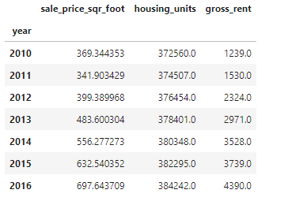
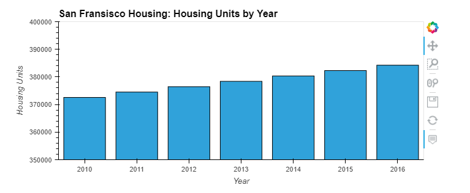
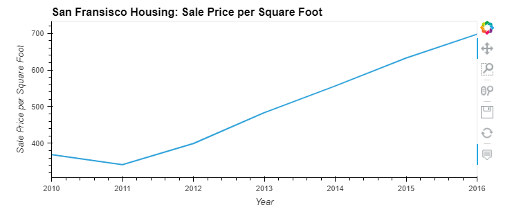
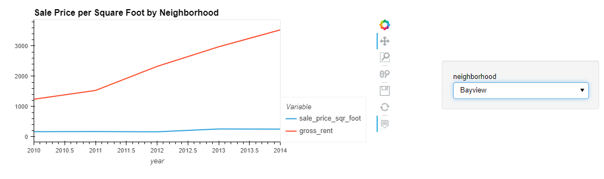
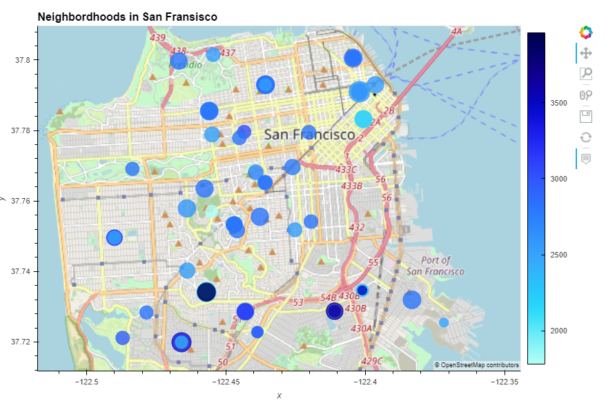

# San Francisco Housing Analysis

The goal of this project was to see if we could create interactive data visualizations that could help a user find investable properties in San Francisco.

---

## Technologies

This program utilizes Python 3.7 with the following packages:

- [Pandas](https://pandas.pydata.org/) to analyze and manipulate data
- [hvplot](https://hvplot.holoviz.org/) to create interactive data visualizations
- [Path](https://docs.python.org/3.7/library/pathlib.html) to load files from a file path

---

## Process

Using the groupby function in python, we first sorted our data by each year and took the mean:

```python
  sfo_data_df.groupby('year').mean()
```




We then put our data in a bar chart to see housing units by year, which shows a gradual increase in housing units in SF:




We then conducted a similar process to see the growth in sales per square foot by year. After falling in 2011, sales per square foot has been in a gradual uptrend:




Using the groupby parameter in hvplot, we were able to analyse the trend in sales per square foot and gross rent for each neighborhood in SF:




Finally, building an interactive map allowed us to see each neighborhood on a map, with larger circles representing neighborhoods with higher sales per square foot, and darker circles representing neighborhoods with higher gross rent.




---

## Conclusion

Our conclusion is that we should pursue investments in houses that have a high gross rent relative to the sales per square foot. This will allow us to maximize our annual return on our investment. In the geographical map, this would be neighborhoods with small and dark(er) circles.

---

## Contributors

This project was created by Matt Wojichowski with the guidance of the University of Washington 2021-2022 FinTech Bootcamp Class.

[Matt Wojichowski LinkedIn](https://www.linkedin.com/in/matt-wojichowski-cfa-caia-93a34a42/)

---

## License

MIT